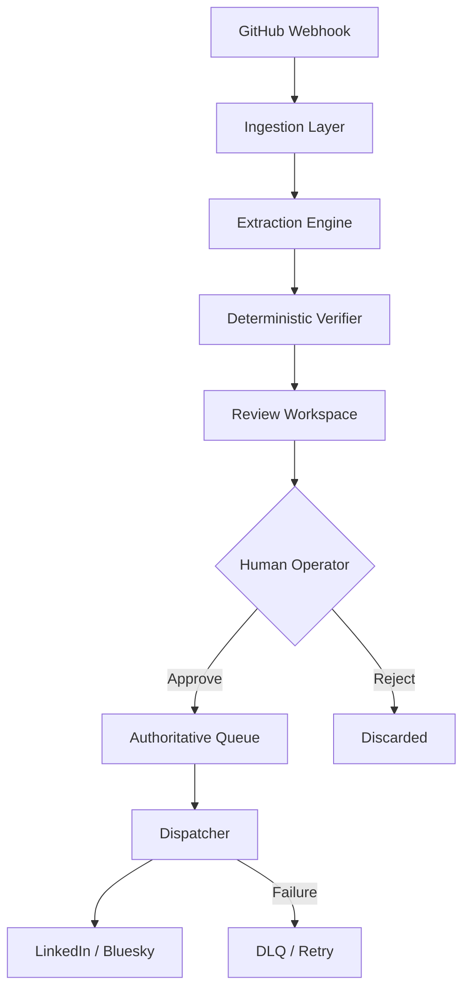

# ProofPost: Deterministic Engineering Fact Compiler

**ProofPost is a deterministic, human-in-the-loop publishing infrastructure that transforms verified engineering activity into professional platform posts.**

Most AI-driven publishing tools suffer from hallucinations and lack grounding. ProofPost addresses this by enforcing a strict **"Verification First"** architecture, ensuring that every post is backed by source material and approved by a human operator before it ever hits a public API.

> [!IMPORTANT]
> **Operational Alpha Notice**: ProofPost is in active V1 development. Core pipeline functionality is stable and trusted. Some features (platform-specific post previews, connection health tests) are V1.1 targets. Do not use in unattended production without reviewing the [V1 Limitations](#v1-status--roadmap) section first.

---

## 60-Second Quickstart

If you want to see ProofPost working before reading the full documentation:

```bash
# 1. Install
git clone https://github.com/your-org/ProofPost.git
cd ProofPost
pip install -r requirements.txt

# 2. Configure (minimum viable settings.json)
# Note for Windows users: Create settings.json manually with this content
cat > settings.json << 'EOF'
{
  "ai":        { "provider": "gemini", "api_key": "YOUR_GEMINI_API_KEY", "model": "gemini-2.0-flash" },
  "ingestion": { "hmac_secret": "test-secret", "max_payload_size": 1048576 },
  "platforms": { "bluesky_handle": "", "bluesky_password": "", "linkedin_token": "" },
  "dry_run":   true,
  "dev_mode":  true
}
EOF

# 3. Run
python main.py

# 4. Open dashboard
# http://localhost:7821
```

> [!WARNING]
> The quickstart uses `dry_run: true` and `dev_mode: true`. **No posts will be published and HMAC is bypassed.** This is intentional for initial setup only. See [Critical Operational Flags](#critical-operational-flags) before disabling either.

---

## What You Should See After Startup

If startup succeeded, the terminal will show structured JSON logs confirming each stage:

```
{"event": "app.startup_initiated", ...}
{"event": "app.mode", "dev_mode": true, "dry_run": true, ...}
{"event": "dispatcher.started", "adapter_count": 1, ...}
{"event": "app.startup_complete", ...}
```

Opening `http://localhost:7821` should display the **ProofPost Dashboard** with:

| Element | Expected State |
|---|---|
| Backend indicator | ✅ Online |
| Database indicator | ✅ Connected |
| AI Provider indicator | ✅ Stable (if Gemini key is valid) |
| Queue Depth | `0 P / 0 D` (empty on first run) |
| Pending badge | Hidden (no facts yet) |

If the dashboard shows **"Backend Offline"**, verify the process is running and bound to port 7821.

---

## Core Philosophy

### 1. Deterministic Verification
AI is used for extraction and summarization, but never for verification. Every fact extracted from a build or commit is cross-referenced against the raw source material using deterministic matching before being presented for approval.

### 2. Human-In-The-Loop
ProofPost follows a zero-trust publishing model. No content leaves the system autonomously. The AI assists by distilling complex engineering changes into readable summaries, but the human operator remains the authoritative gatekeeper.

### 3. Local-First Infrastructure
ProofPost is designed to run on your local machine or internal infrastructure. It uses a local SQLite database for authoritative persistence, ensuring you maintain full control over your engineering metadata and publishing history.

---

## System Architecture

ProofPost operates as a unidirectional compiler pipeline:



### Components
- **Ingestion**: Validates HMAC signatures and enforces payload size limits.
- **Extraction**: Uses Gemini (google-genai) to distill structured facts from payloads.
- **Verification**: Validates extracted facts against raw source context.
- **Review Workspace**: A high-fidelity UI for operator inspection and editing.
- **Dispatcher**: Managed queue with exponential backoff and crash recovery.

---

## Repository Structure

```
ProofPost/
│
├── main.py                    # Entry point (starts uvicorn on port 7821)
├── settings.json              # Runtime configuration (not committed)
├── requirements.txt
│
├── core/
│   ├── main.py                # FastAPI app definition, all routes, lifespan
│   ├── config.py              # Settings loader (reads settings.json)
│   ├── database.py            # All SQLite operations (single DB access point)
│   └── models.py              # VerifiedBuildFact — the canonical data contract
│
├── ingestion/
│   ├── hmac_verifier.py       # GitHub webhook signature validation
│   ├── size_limiter.py        # Payload size enforcement
│   ├── deduplicator.py        # SHA-256 idempotency check
│   └── payload_sanitizer.py  # XSS and injection filtering
│
├── extraction/
│   ├── extractor.py           # Orchestrates LLM provider → VerifiedBuildFact
│   ├── base_provider.py       # Provider interface (Protocol)
│   ├── gemini_provider.py     # Gemini (google-genai) implementation
│   └── mock_provider.py       # Deterministic mock for testing
│
├── verification/
│   └── verifier.py            # Deterministic string-match against source
│
├── execution/
│   ├── dispatcher.py          # Multi-platform publish orchestrator
│   ├── event_bus.py           # Async asyncio queue between pipeline stages
│   ├── retry.py               # Async retry with backoff logic
│   ├── jitter_engine.py       # Exponential backoff with jitter
│   └── dlq.py                 # Dead Letter Queue for failed dispatches
│
├── platforms/
│   ├── bluesky.py             # Bluesky (atproto) adapter
│   └── linkedin.py            # LinkedIn API adapter
│
├── schemas/
│   └── responses.py           # Pydantic response models for all API endpoints
│
├── ui/
│   └── index.html             # Single-file operator dashboard (vanilla JS/CSS)
│
├── tests/                     # pytest test suite
└── docs/                      # Architecture, governance, and UI documentation
```

---

## Installation

### Prerequisites
- Python 3.10+
- A Google AI Studio API Key (for Gemini extraction)
- ngrok (for local webhook testing)

### Setup
1. **Clone and Install**:
   ```bash
   git clone https://github.com/your-org/ProofPost.git
   cd ProofPost
   pip install -r requirements.txt
   ```

2. **Initialize Settings**:
   Create a `settings.json` in the root directory (see [Configuration](#configuration) below).

3. **Launch ProofPost**:
   ```bash
   python main.py
   ```
   Access the dashboard at `http://localhost:7821`.

---

## Configuration

ProofPost is configured via `settings.json`. Sensitive credentials can also be managed through the **Settings** view in the dashboard.

```json
{
  "ai": {
    "provider": "gemini",
    "api_key": "YOUR_GEMINI_API_KEY",
    "model": "gemini-2.0-flash"
  },
  "ingestion": {
    "hmac_secret": "YOUR_GITHUB_WEBHOOK_SECRET",
    "max_payload_size": 1048576
  },
  "platforms": {
    "bluesky_handle": "user.bsky.social",
    "bluesky_password": "YOUR_APP_PASSWORD",
    "linkedin_token": "YOUR_ACCESS_TOKEN"
  },
  "dry_run": false,
  "dev_mode": false
}
```

### Critical Operational Flags

> [!WARNING]
> **`dry_run: false`** means ProofPost will publish to real platform APIs when a fact is approved. Confirm your credentials and content before disabling DRY_RUN in any environment connected to a real GitHub repository.

| Flag | Default | Effect |
|---|---|---|
| `dry_run` | `false` | When `true`: full pipeline runs, **no platform API calls made**. Use for testing. |
| `dev_mode` | `false` | When `true`: GitHub HMAC signature check is **bypassed**. Use only for local `curl` testing. |

**Never set `dev_mode: true` in a production environment exposed via ngrok.** HMAC verification is your only authentication layer for incoming webhooks.

---

## Platform Support Matrix

| Platform | Status | Authentication | Notes |
|---|---|---|---|
| **LinkedIn** | ✅ V1 Supported | OAuth Access Token | Requires a LinkedIn developer app |
| **Bluesky** | ✅ V1 Supported | Handle + App Password | Use an App Password, not your account password |
| Reddit | 🔲 Planned V2 | OAuth | — |
| Telegram | 🔲 Planned V2 | Bot Token | — |

Platforms are configured via `settings.json`. Only platforms with valid credentials are initialized at startup. The **Platforms** view in the dashboard shows live connection status.

---

## Webhook Integration

To receive real-time engineering facts, connect ProofPost to your GitHub repository:

1. **Start ngrok**:
   ```bash
   ngrok http 7821
   ```
2. **Configure GitHub**:
   - Go to Repository Settings → Webhooks → Add Webhook.
   - **Payload URL**: Your ngrok URL + `/webhook/github`.
   - **Content type**: `application/json`.
   - **Secret**: Must match your `hmac_secret` in `settings.json`.
   - **Events**: Select `Push` and `Pull requests`.

> [!NOTE]
> Each time ngrok restarts, your public URL changes. Update the GitHub webhook Payload URL accordingly.

---

## Daily Operator Workflow

This is the complete operational loop during normal use:

```
1.  Morning: verify python main.py is running (check logs or dashboard health bar)
2.  Push or merge code to GitHub
3.  ProofPost ingests the webhook → extracts facts → verifies against source
4.  Open http://localhost:7821 → click "Pending" in the sidebar
5.  For each fact card:
    a. Read the Source Context (repository, SHA, commit message)
    b. Review the Confidence Score
    c. Read or edit the Generated Post in the text area
    d. Check the character count (280-char limit displayed inline)
    e. Click "Approve & Dispatch" or "Discard"
6.  Approved facts are queued immediately and dispatched to configured platforms
7.  Check the "History" view to confirm successful dispatch
8.  Check the "Platforms" view if a platform shows as disconnected
```

**Typical session time**: 2–5 minutes per webhook event.

---

## Security Model

ProofPost is a local-first operator tool. Its threat model is scoped accordingly.

### What is protected
- **Webhook integrity**: Every incoming GitHub request is validated via HMAC-SHA256 signature. Requests with invalid or missing signatures are rejected with `401`.
- **Payload injection**: All webhook payloads are sanitized for XSS and injection patterns before entering the pipeline.
- **Deduplication**: SHA-256 hashing prevents the same payload from being processed twice, even under retry conditions.
- **Credential masking**: The `/api/settings` endpoint returns `****` for all secrets. Credentials are never stored in the browser or sent back in full after initial save.

### What is not protected (V1 scope)
- **Dashboard authentication**: The operator dashboard has no login. It assumes single-user localhost access. **Do not expose port 7821 to the public internet.**
- **Multi-user isolation**: There is no concept of roles or user accounts in V1.
- **Audit log**: Actions (approve, reject, save settings) are logged to structlog but are not surfaced as a user-facing audit trail in V1.

> [!CAUTION]
> If you expose ProofPost via ngrok for testing, the `/webhook/github` endpoint is protected by HMAC, but the **dashboard at `/` is publicly accessible**. Restrict ngrok access or stop the ngrok tunnel when not actively testing webhooks.

---


## Troubleshooting

| Issue | Cause | Solution |
|---|---|---|
| `401 Unauthorized` | Invalid HMAC Secret | Ensure `hmac_secret` matches GitHub webhook secret. |
| `413 Payload Too Large` | Webhook size exceeds limit | Increase `max_payload_size` in `settings.json`. |
| `AI Extraction Failed` | Invalid API Key | Verify your Gemini API key in the Settings view. |
| `Backend Offline` | Process not running | Ensure `python main.py` is active and bound to port 7821. |
| Pending view empty | No facts extracted | Check structlog output for extraction errors. |
| Platform shows Disconnected | Missing or invalid credential | Update the credential in Settings and save. |
| ngrok URL changed | ngrok restarted | Update the Payload URL in GitHub webhook settings. |
| History shows 'Unknown' platform | Dispatch incomplete or legacy | Ensure dispatch was successful and `deployed_to` is populated. |

---

## V1 Status & Roadmap

> [!NOTE]
> ProofPost is currently in **Operational Alpha (V1)**. The core pipeline — ingestion, extraction, verification, approval, and dispatch — is stable and functional for single-user local use.

### V1 Limitations
- **Single User**: Designed for a single operator/owner.
- **Single-threaded Extraction**: AI extraction happens sequentially but is non-blocking for the UI.
- **Manual Hyperlinks**: Links to GitHub source must be added manually in the editor.
- **Platform Hardcoding**: Platform adapters are initialized at startup; changing credentials requires a settings save and adapter re-initialization.

### Roadmap
- **V1.1**: Enhanced UI previews, connection health tests, settings validation.
- **V1.2**: Batch approval and platform-specific formatting overrides.
- **V2.0**: Multi-platform orchestration and Model Context Protocol (MCP) integration.

---

*Deterministic engineering. Verified publishing.*
