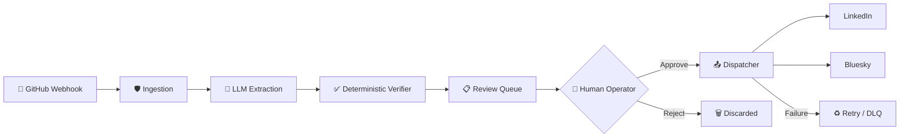

<p align="center">
  <h1 align="center">ProofPost</h1>
  <p align="center">
    <strong>Deterministic Engineering Fact Compiler</strong>
  </p>
  <p align="center">
    Transform verified engineering activity into professional platform posts.<br/>
    AI extracts. Humans verify. Nothing publishes without approval.
  </p>
  <p align="center">
    <a href="#quickstart"><strong>Quickstart</strong></a> · 
    <a href="#architecture"><strong>Architecture</strong></a> · 
    <a href="#configuration"><strong>Configuration</strong></a> · 
    <a href="./docs/PUBLIC_ENGINEERING_PHILOSOPHY.md"><strong>Philosophy</strong></a> · 
    <a href="./docs/ROADMAP.md"><strong>Roadmap</strong></a>
  </p>
  <p align="center">
    
    
    
    
    
  </p>
</p>

---

## The Problem

Engineers ship fast. Communication lags behind.

Every merged PR, every performance fix, every breaking change — these are valuable signals that deserve to be shared publicly. But manually summarizing your own work into LinkedIn and Bluesky posts is tedious, repetitive, and usually the first thing that gets dropped.

**ProofPost closes that gap.** It watches your GitHub activity, extracts the engineering facts, verifies them against the actual source code, and prepares professional draft posts — all under your full editorial control.

> [!IMPORTANT]
> ProofPost is in **Operational Alpha (V1)**. The core pipeline is stable for single-user local use. See [V1 Limitations](#v1-limitations) before deploying.

---

## How It Works

```
Push code → Webhook fires → AI extracts facts → Verified against source
    → You review in dashboard → You click Approve → Published to platforms
```

That's it. No autonomous posting. No background magic. You remain the editor and the publisher.

---

## What ProofPost Is — And Isn't

| ✅ ProofPost IS | ❌ ProofPost IS NOT |
|---|---|
| A local-first infrastructure tool | An autonomous AI agent |
| A verification engine with human approval | A marketing automation bot |
| A single-binary publishing pipeline | A SaaS platform or cloud service |
| Grounded in source code and commit data | Generating content from thin air |

---

<a id="quickstart"></a>

## Quickstart

### Prerequisites

- Python 3.10+
- A [Google AI Studio](https://aistudio.google.com/) API key (for Gemini extraction) — or a free [Groq](https://console.groq.com/) key
- [ngrok](https://ngrok.com/) (for receiving GitHub webhooks locally)

### Setup

```bash
# Clone
git clone https://github.com/VasisthaVed/ProofPost.git
cd ProofPost

# Install dependencies
pip install -r requirements.txt

# Create your configuration
cp settings.example.json settings.json
```

Edit `settings.json` with your API keys:

```jsonc
{
  "ai": {
    "provider": "gemini",                          // or "groq" (free tier available)
    "api_key": "YOUR_API_KEY",
    "model": "gemini-2.0-flash"                    // or "llama-3.3-70b-versatile" for Groq
  },
  "ingestion": {
    "hmac_secret": "your-github-webhook-secret"    // must match GitHub webhook config
  },
  "dry_run": true                                  // ← start here. no real posts.
}
```

### Launch

```bash
python main.py
```

Open **http://localhost:7821** — the operator dashboard.

> [!TIP]
> Start with `"dry_run": true`. The full pipeline runs (extraction, verification, review) but no posts are published. Flip to `false` only when you're ready to go live.

---

<a id="architecture"></a>

## Architecture

ProofPost is a **unidirectional compiler pipeline**. Data flows in one direction only: from source code activity → to verified, human-approved public posts.



### Pipeline Stages

| Stage | Module | What It Does |
|---|---|---|
| **Ingestion** | `ingestion/` | HMAC-SHA256 validation, size limits, deduplication, XSS sanitization |
| **Extraction** | `extraction/` | LLM-powered fact extraction (Gemini, Groq, or mock for testing) |
| **Verification** | `verification/` | Deterministic string-match against raw commit/diff data |
| **Review** | `ui/index.html` | Operator dashboard — inspect, edit, approve, or reject |
| **Dispatch** | `execution/` | Async multi-platform publish with retry, backoff, and crash recovery |

### Key Design Decisions

- **AI is non-authoritative.** LLMs extract and summarize. They never verify or publish.
- **SQLite is the source of truth.** All state transitions are persisted atomically.
- **Dispatch is idempotent.** Facts track which platforms they've been published to, preventing duplicate posts even after crashes.
- **Status lifecycle is enforced:** `pending` → `approved` → `dispatching` → `dispatched`

---

<a id="configuration"></a>

## Configuration

ProofPost uses a single `settings.json` file. Copy the template to get started:

```bash
cp settings.example.json settings.json
```

### Configuration Reference

| Key | Type | Default | Description |
|---|---|---|---|
| `ai.provider` | `string` | `"mock"` | AI backend: `"gemini"`, `"groq"`, or `"mock"` |
| `ai.api_key` | `string` | `""` | API key for the selected provider |
| `ai.model` | `string` | `"gemini-2.0-flash"` | Model identifier |
| `ingestion.hmac_secret` | `string` | — | GitHub webhook secret (must match) |
| `ingestion.max_payload_size` | `int` | `1048576` | Max webhook payload size in bytes |
| `platforms.bluesky.handle` | `string` | `""` | Your `*.bsky.social` handle |
| `platforms.bluesky.app_password` | `string` | `""` | Bluesky App Password ([create one here](https://bsky.app/settings/app-passwords)) |
| `platforms.linkedin.access_token` | `string` | `""` | LinkedIn OAuth access token |
| `dry_run` | `bool` | `false` | Full pipeline runs, but no posts are actually published |
| `dev_mode` | `bool` | `false` | Bypasses HMAC verification (local testing only) |

> [!WARNING]
> **Never set `dev_mode: true` when exposed via ngrok.** HMAC verification is your only authentication layer for incoming webhooks.

---

## Webhook Setup

Connect ProofPost to your GitHub repository:

```bash
# Terminal 1: Start ProofPost
python main.py

# Terminal 2: Expose via ngrok
ngrok http 7821
```

Then in GitHub:

1. Go to **Repository → Settings → Webhooks → Add Webhook**
2. **Payload URL**: `https://your-ngrok-url.ngrok-free.app/webhook/github`
3. **Content type**: `application/json`
4. **Secret**: Must match `hmac_secret` in your `settings.json`
5. **Events**: Select **Pushes** and **Pull Requests**

Push a commit. ProofPost will extract facts and queue them for your review.

---

## Daily Workflow

```
 ┌─────────────────────────────────────────────────────────────────┐
 │  1. Push code to GitHub                                        │
 │  2. ProofPost ingests webhook → extracts facts → verifies      │
 │  3. Open dashboard → Pending tab                               │
 │  4. Review each fact card:                                     │
 │     • Read the source context (repo, SHA, commit message)      │
 │     • Check the confidence score                               │
 │     • Edit the generated post if needed                        │
 │     • Click "Approve & Dispatch" or discard                    │
 │  5. Check History tab to confirm successful dispatch           │
 └─────────────────────────────────────────────────────────────────┘
```

**Typical session time:** 2–5 minutes per webhook event.

---

## Platform Support

| Platform | Status | Auth Method | Notes |
|---|---|---|---|
| **Bluesky** | ✅ Supported | Handle + App Password | Use an [App Password](https://bsky.app/settings/app-passwords), not your account password |
| **LinkedIn** | ✅ Supported | OAuth Access Token | Requires a LinkedIn developer app |
| Reddit | 🔲 Planned | OAuth | V2 target |
| Telegram | 🔲 Planned | Bot Token | V2 target |

---

## Repository Structure

```
ProofPost/
├── main.py                     # Entry point → uvicorn on port 7821
├── settings.example.json       # Safe configuration template
├── requirements.txt
│
├── core/
│   ├── main.py                 # FastAPI app, routes, lifespan
│   ├── config.py               # Settings loader (Pydantic models)
│   ├── database.py             # SQLite operations (single access point)
│   └── models.py               # VerifiedBuildFact — the canonical data contract
│
├── ingestion/                  # Webhook validation & sanitization
│   ├── hmac_verifier.py        # HMAC-SHA256 signature validation
│   ├── deduplicator.py         # SHA-256 idempotency
│   ├── size_limiter.py         # Payload size enforcement
│   └── payload_sanitizer.py    # XSS/injection filtering
│
├── extraction/                 # LLM-powered fact extraction
│   ├── extractor.py            # Orchestrator with timeout & deduplication
│   ├── base_provider.py        # Provider interface (Protocol)
│   ├── gemini_provider.py      # Google Gemini implementation
│   ├── groq_provider.py        # Groq (Llama 70B) implementation
│   └── mock_provider.py        # Deterministic mock for testing
│
├── verification/
│   └── verifier.py             # Deterministic source-match verification
│
├── execution/                  # Dispatch & reliability
│   ├── dispatcher.py           # Multi-platform publish orchestrator
│   ├── event_bus.py            # Async queue between pipeline stages
│   ├── retry.py                # Retry with exponential backoff
│   ├── jitter_engine.py        # Backoff jitter calculation
│   └── dlq.py                  # Dead Letter Queue
│
├── platforms/                  # Platform adapters
│   ├── bluesky.py              # Bluesky (AT Protocol)
│   └── linkedin.py             # LinkedIn API
│
├── ui/
│   └── index.html              # Operator dashboard (single-file, vanilla JS)
│
├── tests/                      # Full pytest suite (17 test files)
│
└── docs/                       # Architecture, governance, API contracts
    ├── governance/             # System constitution & AI rules
    ├── ui/                    # Dashboard architecture docs
    └── PUBLIC_ENGINEERING_PHILOSOPHY.md
```

---

## Security Model

ProofPost is a **local-first operator tool**. Its security is designed around a single trusted user on a local network.

| Layer | Protection |
|---|---|
| **Inbound Webhooks** | HMAC-SHA256 signature validation on every request |
| **Payload Integrity** | XSS sanitization, size limits, SHA-256 deduplication |
| **Credential Storage** | Local `settings.json` only; masked in all API responses |
| **Dispatch Safety** | Atomic status transitions prevent duplicate posts |
| **Dashboard** | No auth in V1 — assumes localhost access only |

> [!CAUTION]
> When using ngrok, the webhook endpoint (`/webhook/github`) is protected by HMAC, but the **dashboard at `/` is publicly accessible**. Stop the ngrok tunnel when you're not actively testing.

---

## Troubleshooting

| Symptom | Cause | Fix |
|---|---|---|
| `401 Unauthorized` on webhook | HMAC secret mismatch | Ensure `hmac_secret` in `settings.json` matches your GitHub webhook secret |
| Dashboard says "Backend Offline" | Server not running | Run `python main.py` and check port 7821 |
| Facts extracted but empty | Bad API key or quota exceeded | Verify your Gemini/Groq API key and check provider logs |
| Approved but nothing posted | `dry_run` is still `true` | Set `"dry_run": false` in `settings.json` and restart |
| Duplicate posts appeared | Recovery + stale queue state | Fixed in V1 — update to latest. Uses atomic `dispatching` state lock |
| ngrok URL changed | ngrok restarted | Update the Payload URL in GitHub webhook settings |

---

## Running Tests

```bash
pytest tests/ -v
```

The test suite covers all pipeline stages: ingestion, extraction, verification, dispatch, database operations, and API routes.

---

<a id="v1-limitations"></a>

## V1 Limitations

ProofPost V1 is a single-operator tool. These are known constraints, not bugs:

- **No dashboard auth** — designed for localhost only
- **Single-threaded extraction** — non-blocking but sequential
- **Platform credentials require restart** — changing keys in Settings reinitializes adapters
- **No batch approval** — facts are approved individually

### Roadmap

| Version | Focus |
|---|---|
| **V1.1** | Platform previews, connection health checks, settings validation |
| **V1.2** | Batch approval, platform-specific formatting |
| **V2.0** | Multi-platform orchestration, MCP integration |

See the full [Roadmap](./docs/ROADMAP.md).

---

## Contributing

ProofPost uses an internal governance model to maintain system integrity:

- **[Constitution](./docs/governance/constitution.md)** — Core invariants that must never be violated
- **[System Rules](./docs/governance/system.md)** — Technical constraints for all contributors
- **[Engineering Philosophy](./docs/PUBLIC_ENGINEERING_PHILOSOPHY.md)** — Why decisions were made the way they were

Before contributing, read the Constitution. The most important rule: **nothing publishes without human approval.**

---

<p align="center">
  <sub>Deterministic engineering. Verified publishing.</sub>
</p>
