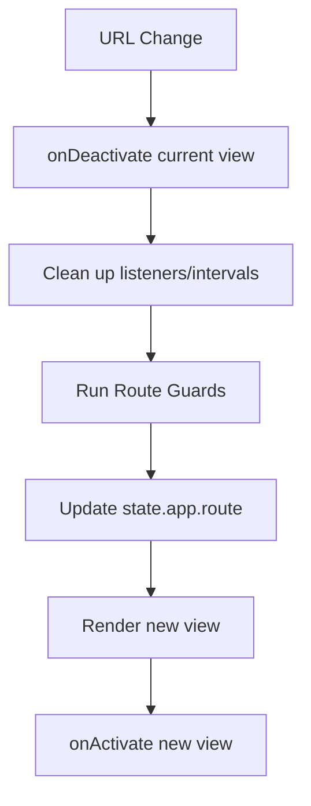

# ProofPost — Routing Specification
# docs/v1.1/ROUTING_SPEC.md

---

# PURPOSE

Defines authoritative routing rules, guards, and lifecycle for ProofPost V1.1.

---

# AUTHORITATIVE ROUTES

| Path | View | Access | Purpose |
| :--- | :--- | :--- | :--- |
| `/` | Dashboard | Public | Redirects to /dashboard |
| `/setup` | Setup Wizard | Public | First-run onboarding |
| `/dashboard` | Dashboard | Protected | System health overview |
| `/workspace` | Workspace | Protected | Fact review and approval |
| `/observability` | Observability | Protected | Pipeline timeline |
| `/history` | History | Protected | Dispatch archive |
| `/platforms` | Platforms | Protected | Platform management |
| `/settings` | Settings | Protected | Configuration |
| `/docs` | Docs | Public | Embedded documentation |

---

# ROUTE GUARDS

### 1. Onboarding Guard
- **Check**: `state.app.setupComplete`
- **Logic**: If `false` and path is NOT `/setup`, `/docs`, or `/settings`, redirect to `/setup`.
- **Purpose**: Ensures system is configured before operation.

### 2. Backend Health Guard
- **Check**: `state.app.apiOnline`
- **Logic**: If `false`, display "Backend Offline" banner. Do not redirect (allow inspection of current state).
- **Purpose**: Prevents user frustration during connection drops.

---

# ROUTE LIFECYCLE

---

# REDIRECT LOGIC

- **Root Redirect**: `/` always pushes to `/dashboard`.
- **Fallback Route**: Any undefined path redirects to `/dashboard` (or 404 view if implemented).
- **Post-Setup**: Completing setup wizard always pushes to `/dashboard`.

---

# BROWSER INTEGRATION

- **History API**: Use `pushState` for navigation.
- **Popstate**: Handle back/forward buttons by triggering the route lifecycle.
- **URL Sync**: Browser address bar must always match `state.app.route`.

---

# SECURITY

- **No Hash Routing**: Use clean URLs via History API.
- **Sensitive Views**: `/settings` should trigger a re-masking of inputs on exit.
